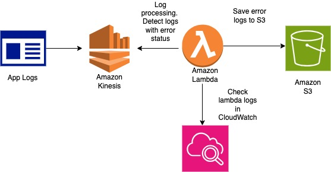

##### Intro 
This project showcases how to stream app logs, detect errors and save them to S3 for further
processing.

Services used: 
- Amazon Lambda
- Amazon Kinesis
- Amazon CloudWatch
- Amazon S3



##### Steps

1. Create Kinesis stream using one of these ways:
 - AWS CLI:
```aws kinesis create-stream --stream-name log_stream --shard-count 1```
 - AWS Console:
   - create a new stream called _log_stream_
 
2. Create a Python script to send events to Kinesis.
See _send_logs_kinesis.py_

3. Make sure you have S3 bucket set up which will be used in lambda
for saving processed logs. 

5. Create a lambda function. 
- See the code for the lambda function in _lambda_process_logs.py_
- add Kinesis trigger so that the lambda gets executed once there is a new data added to Kinesis
- set up Lambda role access for S3 bucket

6. Run _send_logs_kinesis.py_ in debug mode - send 1-2 logs 
   1. check S3 bucket to see the processed logs there
   2. if the logs folder is not created in S3 bucket, check the Cloudwatch logs for the lambda for errors
   
Expected result: you will see a logs folder with json files in S3 bucket that you specified in the lambda function. 
See _s3_logs_example_ directory for log samples.

###### Kineses notes

Producers: put records into Kinesis Data Streams. 
Consumers: get records from Kinesis Data Streams and process them.

###### Lambda notes

How to create a lambda function in the AWS console: 
- create new function 
  - choose runtime (python/nodejs etc)
  - choose role
  - insert code
- create from template
- create based on Docker image
 
